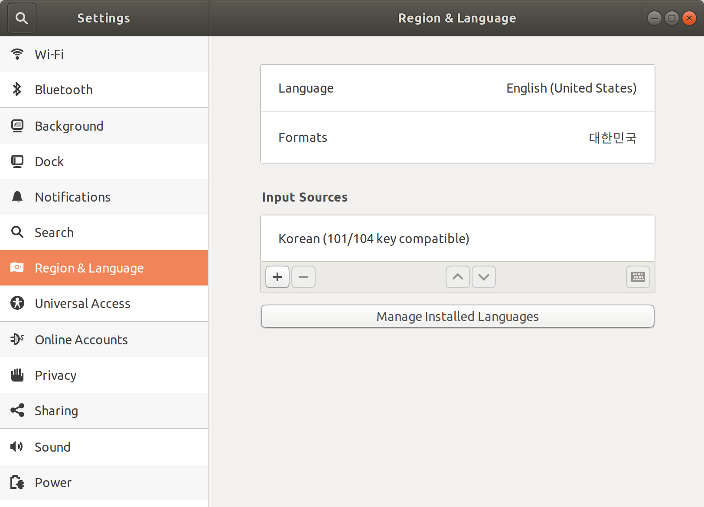
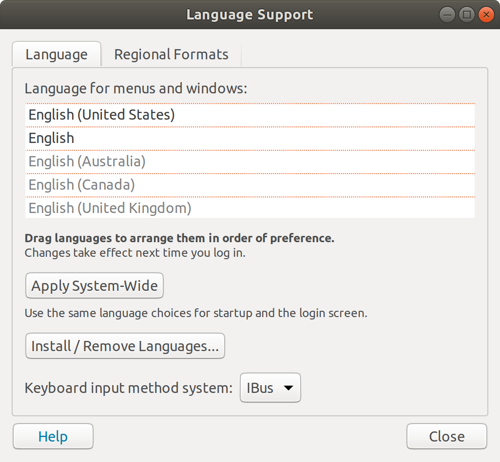
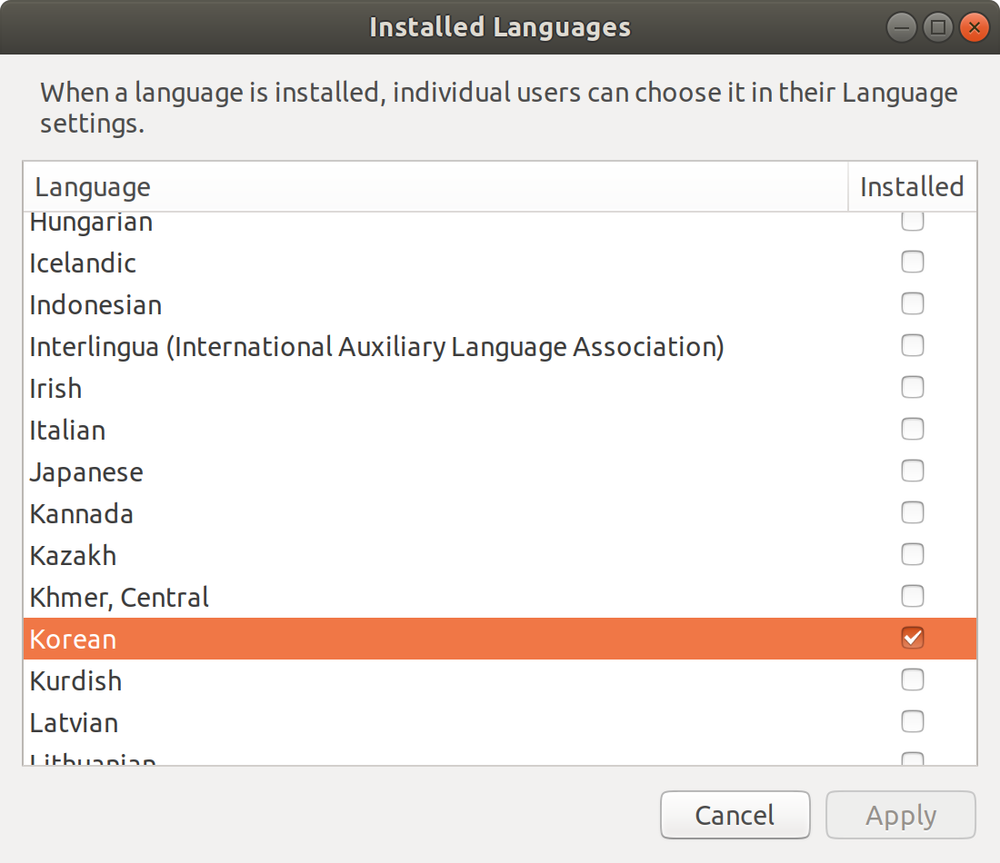
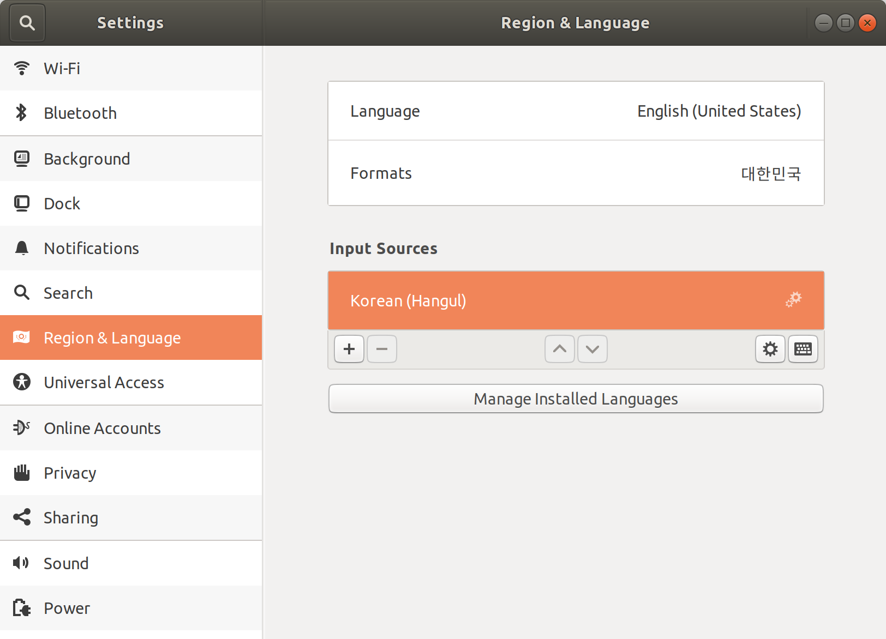
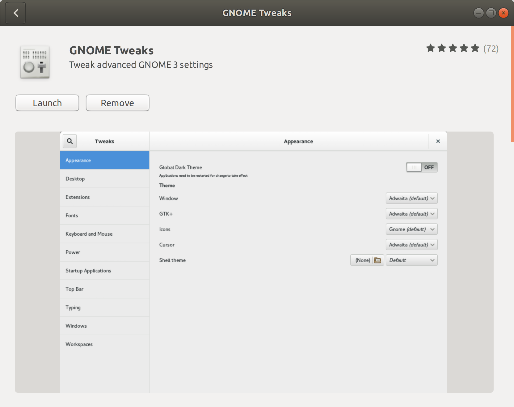
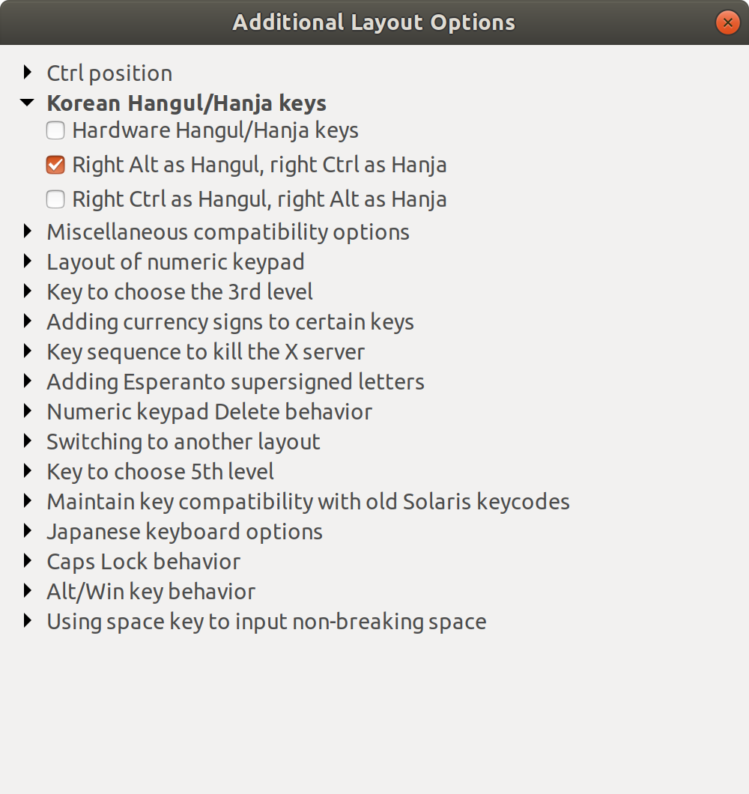

# OS

## Ubuntu 18.04

### Hangul

* Add Korean

    1. Open **Settings > Region & Language**

        

    2. Click **Manage Installed languages**

        

    3. Click **Install / Remove Languages...**

    4. Check **Korean**
    
        

    5. Apply

    6. Add **Korean (Hangul)** to **Input Sources**
        
        > If it is does not appear, restart ubuntu

        

* Korean Hangul/Hanja keys

    1. Open **Ubuntu Software**
    
    2. Install **GNOME Tweaks**

        

    3. Open **GNOME Tweaks > Keyboard & Mouse**

        

    4. Click "Additional Layout Options"

        

    5. Check **Right Alt as Hangul, right Ctrl as Hanja**